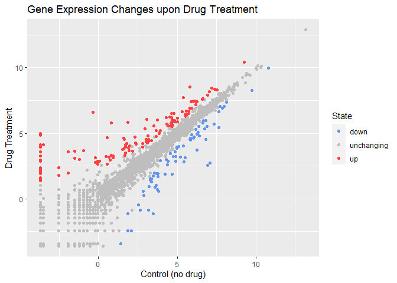

# Class 5: Data Visualization with ggplot
Yu-Chia Huang (PID: A59026739)

## Using GGPLOT

To use ggplot2 we first need to install it on our computers. To do this
we will use the function `install.packages()`.

Before I use any package functions I have to load them up with a
`library()` call, like so:

``` r
library(ggplot2)
#ggplot(cars)
```

``` r
#cars
```

There is always the “base R” graphics system, i.e. `plot()`

``` r
#plot(cars)
```

To use ggplot I need to spell out at least 3 things:

- data (the stuff I want to plot as a data.frame)
- aesthetics (aes() values - how the data map to the plot).
- geoms (how I want things drawn)

``` r
#ggplot(cars) +
  #aes(x=speed, y=dist) +
  #geom_point() +
  #geom_smooth(method="lm")
```

`geom_smooth()`using formula = ‘y ~ x’

``` r
url <- "https://bioboot.github.io/bimm143_S20/class-material/up_down_expression.txt"
genes <- read.delim(url)
head(genes)
```

            Gene Condition1 Condition2      State
    1      A4GNT -3.6808610 -3.4401355 unchanging
    2       AAAS  4.5479580  4.3864126 unchanging
    3      AASDH  3.7190695  3.4787276 unchanging
    4       AATF  5.0784720  5.0151916 unchanging
    5       AATK  0.4711421  0.5598642 unchanging
    6 AB015752.4 -3.6808610 -3.5921390 unchanging

Q. How many genes are there?

``` r
nrow(genes)
```

    [1] 5196

There are 5196 in this dataset.

Q. What are the column names?

``` r
colnames(genes)
```

    [1] "Gene"       "Condition1" "Condition2" "State"     

The column names are Gene, Condition1, Condition2, State.

Q. How many columns did you find?

``` r
ncol(genes)
```

    [1] 4

I found 4 columns.

Q. How many are “up” regulated genes?

``` r
sum(genes$State == "up")
```

    [1] 127

There are 127 up-regulated genes.

Q. What fraction of total genes is up-regulated in this dataset?

``` r
round(table(genes$State)/nrow(genes) * 100, 2)
```


          down unchanging         up 
          1.39      96.17       2.44 

The fraction of up-regulated genes is 2.44.

Q. Complete the code below to produce the following plot.

``` r
p <- ggplot(genes) + 
  aes(x=Condition1, y=Condition2, col=State) +
  geom_point()
p + scale_color_manual(values = c("cornflowerblue", "gray", "brown1")) +
  labs(title="Gene Expression Changes upon Drug Treatment") +
  xlab("Control (no drug)") +
  ylab("Drug Treatment")
```


